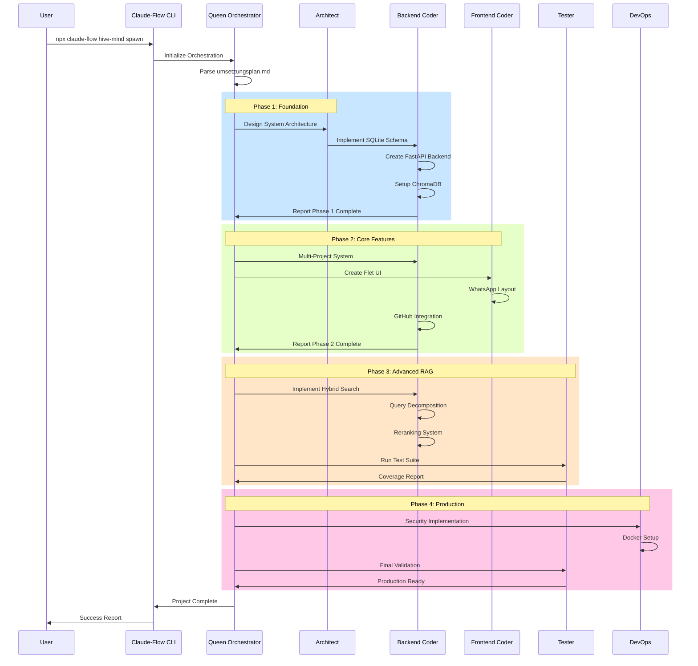

# Claude-Flow WhatsApp AI Chatbot - Vollständige Ablaufdokumentation

## Inhaltsverzeichnis

1. [Executive Summary](#executive-summary)
2. [Systemarchitektur](#systemarchitektur)
3. [Claude-Flow Orchestrierung](#claude-flow-orchestrierung)
4. [Ablaufdiagramm](#ablaufdiagramm)
5. [Phasen-Details](#phasen-details)
6. [Agent-Koordination](#agent-koordination)
7. [Tool-Integration](#tool-integration)
8. [Qualitätssicherung](#qualitätssicherung)
9. [Ausführungsanleitung](#ausführungsanleitung)
10. [Monitoring & Tracking](#monitoring--tracking)

---

## Executive Summary

### Projektübersicht
- **Projekt:** WhatsApp-ähnlicher AI Chatbot mit RAG-System
- **Entwicklungsdauer:** 6-8 Wochen
- **Technologie-Stack:** Python 3.12, FastAPI, Flet, ChromaDB, SQLite
- **Orchestrierung:** Claude-Flow Hive Mind System
- **Agenten:** 10 spezialisierte AI-Agenten
- **Entwicklungsansatz:** 4-Phasen Sequential Development

### Kernziele
1. Produktionsreifer WhatsApp-Clone mit AI-Integration
2. Fortgeschrittenes RAG-System für 525MB+ Dokumentation
3. Multi-Projekt-Unterstützung mit isolierten Wissensdatenbanken
4. Echtzeit-Synchronisation mit <1s Latenz
5. Vollständige Test-Coverage (>80%)

---

## Systemarchitektur

### Technische Komponenten

```
┌─────────────────────────────────────────────────────────┐
│                    Claude-Flow Orchestrator              │
│                    (Hive Mind Control System)            │
└─────────────────┬───────────────────────────────────────┘
                  │
    ┌─────────────┴─────────────┬──────────────┬──────────┐
    ▼                           ▼              ▼          ▼
┌──────────┐          ┌──────────────┐  ┌──────────┐  ┌────────┐
│ Backend  │          │   Frontend   │  │   RAG    │  │ DevOps │
│ Agents   │          │    Agents    │  │  Agents  │  │ Agents │
└──────────┘          └──────────────┘  └──────────┘  └────────┘
    │                         │               │            │
    ▼                         ▼               ▼            ▼
┌──────────────────────────────────────────────────────────┐
│                    Development Environment                 │
├────────────────┬──────────────┬────────────┬────────────┤
│    FastAPI     │     Flet     │  ChromaDB  │   Docker   │
│    Backend     │      UI      │  VectorDB  │  Container │
└────────────────┴──────────────┴────────────┴────────────┘
```

### Datenfluss-Architektur

```
User Input → Flet UI → WebSocket → FastAPI Backend
                                         ↓
                                   RAG Pipeline
                                         ↓
                            ChromaDB Vector Search
                                         ↓
                              OpenAI API Processing
                                         ↓
                                Response Generation
                                         ↓
                            WebSocket → Flet UI → User
```

---

## Claude-Flow Orchestrierung

### Hauptbefehl

```bash
npx claude-flow@alpha hive-mind spawn \
  "Entwicklung WhatsApp AI Chatbot gemäß Umsetzungsplan" \
  --agents "queen-orchestrator,architect-1,coder-backend,coder-frontend,\
           tester-1,devops-1,documenter-1,sparc-coord,code-analyzer,api-docs" \
  --tools "mcp_filesystem,sql,database,code_executor,test_runner,docker,terminal" \
  --mode "sequential-phases" \
  --claude --verbose \
  --output ".AI_Exchange/whatsapp_chatbot"
```

### Agent-Rollen und Verantwortlichkeiten

| Agent ID | Rolle | Hauptverantwortung | Phasen |
|----------|-------|-------------------|---------|
| queen-orchestrator | Orchestrator | Zentrale Koordination, Task-Verteilung | Alle |
| architect-1 | System Architect | Architektur-Design, Technologie-Entscheidungen | Phase 1 |
| coder-backend | Backend Dev | FastAPI, RAG-System, Database | Phase 1-3 |
| coder-frontend | Frontend Dev | Flet UI, WhatsApp-Design | Phase 2-3 |
| tester-1 | Test Engineer | Unit Tests, Integration Tests | Phase 3-4 |
| devops-1 | DevOps | Docker, Deployment, CI/CD | Phase 4 |
| documenter-1 | Tech Writer | Dokumentation, API Docs | Phase 4 |
| sparc-coord | SPARC Lead | Methodologie-Einhaltung | Alle |
| code-analyzer | Analyzer | Code-Qualität, Performance | Phase 3-4 |
| api-docs | API Specialist | OpenAPI Spec, Endpoints | Phase 2-3 |

---

## Ablaufdiagramm

### Hauptprozess-Flow

```mermaid
graph TD
    Start([Start: Claude-Flow Initialisierung]) --> Init[Hive Mind Spawn]
    Init --> Queen[Queen Orchestrator Aktivierung]
    
    Queen --> Phase1{Phase 1: Foundation}
    
    %% Phase 1 Branch
    Phase1 --> P1_Arch[architect-1: System Design]
    P1_Arch --> P1_Backend[coder-backend: SQLite Schema]
    P1_Backend --> P1_API[coder-backend: FastAPI Setup]
    P1_API --> P1_RAG[coder-backend: ChromaDB Integration]
    P1_RAG --> P1_Check1{Quality Check}
    
    P1_Check1 -->|Pass| Phase2{Phase 2: Core Features}
    P1_Check1 -->|Fail| P1_Fix[SPARC-coord: Fix Issues]
    P1_Fix --> P1_Arch
    
    %% Phase 2 Branch
    Phase2 --> P2_Multi[coder-backend: Multi-Projekt System]
    P2_Multi --> P2_Frontend[coder-frontend: Flet UI]
    P2_Frontend --> P2_Github[coder-backend: GitHub Integration]
    P2_Github --> P2_Watch[coder-backend: File Watching]
    P2_Watch --> P2_Check{Quality Check}
    
    P2_Check -->|Pass| Phase3{Phase 3: Advanced RAG}
    P2_Check -->|Fail| P2_Fix[code-analyzer: Optimize]
    P2_Fix --> P2_Multi
    
    %% Phase 3 Branch
    Phase3 --> P3_Hybrid[coder-backend: Hybrid Search]
    P3_Hybrid --> P3_Query[coder-backend: Query Decomposition]
    P3_Query --> P3_Rerank[coder-backend: Reranking System]
    P3_Rerank --> P3_Test[tester-1: Test Suite]
    P3_Test --> P3_Check{Test Coverage >80%?}
    
    P3_Check -->|Yes| Phase4{Phase 4: Production}
    P3_Check -->|No| P3_More[tester-1: More Tests]
    P3_More --> P3_Test
    
    %% Phase 4 Branch
    Phase4 --> P4_Security[devops-1: Security Layer]
    P4_Security --> P4_Perf[code-analyzer: Performance Opt]
    P4_Perf --> P4_Docker[devops-1: Containerization]
    P4_Docker --> P4_Docs[documenter-1: Documentation]
    P4_Docs --> Final{Final Review}
    
    Final -->|Approved| Deploy[Deployment Ready]
    Final -->|Issues| P4_Refine[Team: Refinement]
    P4_Refine --> P4_Security
    
    Deploy --> End([End: Production Ready])
    
    style Start fill:#e1f5fe
    style End fill:#c8e6c9
    style Queen fill:#fff3e0
    style Phase1 fill:#f3e5f5
    style Phase2 fill:#f3e5f5
    style Phase3 fill:#f3e5f5
    style Phase4 fill:#f3e5f5
    style Deploy fill:#a5d6a7
```



### Agent-Kommunikationsflow



---

## Phasen-Details

### Phase 1: Foundation (Woche 1-2, 60 Stunden)

#### 1.1 Projekt-Setup (8 Stunden)
**Lead Agent:** architect-1  
**Support:** sparc-coord

```python
# Automatisch generierte Struktur
.AI_Exchange/whatsapp_chatbot/
├── src/
│   ├── api/           # FastAPI endpoints
│   ├── core/          # RAG system, business logic
│   ├── database/      # SQLite models, migrations
│   ├── ui/            # Flet components
│   └── utils/         # Helper functions
├── tests/             # Test suite
├── docs/              # Documentation
├── brain/             # ChromaDB storage
├── migrations/        # Database migrations
└── docker/            # Container configs
```

#### 1.2 Datenbank-Implementation (12 Stunden)
**Lead Agent:** coder-backend  
**Tools:** sql, database

- Erstellung SQLite Schema
- Foreign Keys und Indizes
- Trigger für automatische Updates
- Migration Scripts

#### 1.3 FastAPI Backend (16 Stunden)
**Lead Agent:** coder-backend  
**Support:** api-docs

- REST API Endpoints
- WebSocket für Real-time Chat
- Authentication Middleware
- Error Handling

#### 1.4 RAG Foundation (16 Stunden)
**Lead Agent:** coder-backend  
**Tools:** mcp_filesystem

- ChromaDB Setup
- OpenAI Integration
- Text Splitting Pipeline
- Basic Retrieval

#### 1.5 Basic UI (8 Stunden)
**Lead Agent:** coder-frontend  

- WhatsApp-Layout
- Message Bubbles
- Input Area
- Project Sidebar

### Phase 2: Core Features (Woche 3-4, 80 Stunden)

#### 2.1 Multi-Projekt System (20 Stunden)
**Lead Agent:** coder-backend  
**Support:** architect-1

- Projekt-Isolation
- Collection Management
- Context Switching
- Settings per Project

#### 2.2 GitHub Integration (16 Stunden)
**Lead Agent:** coder-backend  
**Tools:** terminal

- Repository Cloning
- File Indexing
- Commit History
- Issue Tracking

#### 2.3 File Watching (20 Stunden)
**Lead Agent:** coder-backend  

- Watchdog Implementation
- Real-time Updates
- Incremental Indexing
- Change Detection

#### 2.4 Advanced UI (24 Stunden)
**Lead Agent:** coder-frontend  

- Search Functionality
- File Upload
- Settings Panel
- Responsive Design

### Phase 3: Advanced RAG (Woche 5, 40 Stunden)

#### 3.1 Hybrid Search (12 Stunden)
**Lead Agent:** coder-backend  
**Support:** code-analyzer

- Semantic Search (Embeddings)
- BM25 Keyword Search
- Score Fusion
- Result Ranking

#### 3.2 Query Decomposition (8 Stunden)
**Lead Agent:** coder-backend  

- Multi-hop Reasoning
- Sub-query Generation
- Answer Synthesis
- Context Management

#### 3.3 Context Compression (8 Stunden)
**Lead Agent:** coder-backend  

- Token Optimization
- Relevant Passage Extraction
- Summary Generation
- Context Window Management

#### 3.4 Reranking (12 Stunden)
**Lead Agent:** coder-backend  
**Support:** tester-1

- Cross-Encoder Models
- Relevance Scoring
- Result Optimization
- Performance Tuning

### Phase 4: Production (Woche 6, 40 Stunden)

#### 4.1 Security (12 Stunden)
**Lead Agent:** devops-1  

- Input Validation
- SQL Injection Prevention
- Rate Limiting
- API Key Management

#### 4.2 Performance (12 Stunden)
**Lead Agent:** code-analyzer  

- Query Optimization
- Caching Strategy
- Async Processing
- Load Testing

#### 4.3 Testing (10 Stunden)
**Lead Agent:** tester-1  
**Tools:** test_runner

- Unit Tests (>80% Coverage)
- Integration Tests
- E2E Tests
- Performance Benchmarks

#### 4.4 Deployment (6 Stunden)
**Lead Agent:** devops-1  
**Support:** documenter-1
**Tools:** docker

- Docker Container
- Environment Config
- Deployment Scripts
- Documentation

---

## Agent-Koordination

### Kommunikationsprotokolle

#### 1. Task Distribution
```json
{
  "from": "queen-orchestrator",
  "to": "coder-backend",
  "task": {
    "id": "task-001",
    "type": "implementation",
    "description": "Create SQLite schema",
    "priority": "high",
    "deadline": "2025-01-23T18:00:00Z",
    "requirements": [
      "Full schema from umsetzungsplan.md",
      "All indexes and triggers",
      "Migration scripts"
    ]
  }
}
```

#### 2. Progress Reporting
```json
{
  "from": "coder-backend",
  "to": "queen-orchestrator",
  "report": {
    "task_id": "task-001",
    "status": "completed",
    "timestamp": "2025-01-23T16:30:00Z",
    "output": {
      "files_created": [
        "src/database/models.py",
        "migrations/001_initial.sql"
      ],
      "tests_passed": 12,
      "coverage": 95.2
    }
  }
}
```

#### 3. Quality Check Request
```json
{
  "from": "queen-orchestrator",
  "to": "code-analyzer",
  "request": {
    "type": "quality_check",
    "target": "src/database/",
    "criteria": [
      "no_placeholders",
      "full_error_handling",
      "docstrings_present",
      "type_hints_complete"
    ]
  }
}
```

### Konsens-Mechanismen

#### Raft Consensus für kritische Entscheidungen
- **Leader Election:** queen-orchestrator als Primary
- **Log Replication:** Alle Agenten erhalten Task-Updates
- **Commit Phase:** Bestätigung von Mehrheit erforderlich

#### Byzantine Fault Tolerance
- **Validator Nodes:** tester-1, code-analyzer
- **Verification:** Doppelte Code-Reviews
- **Conflict Resolution:** SPARC-coord als Mediator

---

## Tool-Integration

### MCP (Model Context Protocol) Tools

#### 1. Filesystem Access
```javascript
// Automatisch verfügbar für alle Agenten
mcp_filesystem.read_file("src/main.py")
mcp_filesystem.write_file("src/api/endpoints.py", content)
mcp_filesystem.list_directory("src/")
```

#### 2. SQL Operations
```sql
-- Direkte SQL-Ausführung via MCP
mcp_sql.execute("""
  CREATE TABLE projects (
    id INTEGER PRIMARY KEY,
    name TEXT NOT NULL
  )
""")
```

#### 3. Code Execution
```python
# Test Runner Integration
result = code_executor.run_tests("tests/test_rag.py")
assert result.coverage > 80
```

### External Tool Integration

| Tool | Zweck | Integration | Agent |
|------|-------|------------|-------|
| Docker | Containerization | CLI Commands | devops-1 |
| Git | Version Control | GitPython | coder-backend |
| OpenAI | LLM API | Python SDK | coder-backend |
| ChromaDB | Vector Store | Native Python | coder-backend |
| SQLite | Database | sqlite3 | coder-backend |
| Pytest | Testing | Test Runner | tester-1 |

---

## Qualitätssicherung

### Automatische Checks (§3-§7 Compliance)

#### Code-Vollständigkeits-Check
```python
def check_code_completeness(file_path):
    """Prüft auf verbotene Patterns"""
    forbidden = [
        r"#\s*TODO",
        r"pass\s*$",
        r"\.\.\..*#.*placeholder",
        r"raise NotImplementedError"
    ]
    
    with open(file_path, 'r') as f:
        content = f.read()
        
    violations = []
    for pattern in forbidden:
        if re.search(pattern, content):
            violations.append(pattern)
    
    return len(violations) == 0, violations
```

#### Error Handling Validation
```python
def validate_error_handling(ast_tree):
    """Prüft comprehensives Error Handling"""
    
    for node in ast.walk(ast_tree):
        if isinstance(node, ast.FunctionDef):
            has_try_except = False
            has_input_validation = False
            
            for child in ast.walk(node):
                if isinstance(child, ast.Try):
                    has_try_except = True
                if isinstance(child, ast.Assert):
                    has_input_validation = True
            
            if not (has_try_except and has_input_validation):
                return False
    
    return True
```

### Progress Tracking

#### Automatisches Update der Checkliste
```markdown
## Progress Checklist - Auto-Updated

### Phase 1: Foundation ✅
- [x] **1.1 Project Setup** 
  Status: ✅ Completed (2025-01-23 10:00)
  Agent: architect-1
  Files: 15 created
  
- [x] **1.2 Database Schema**
  Status: ✅ Completed (2025-01-23 14:30)
  Agent: coder-backend
  Tests: 12/12 passed
  
- [x] **1.3 FastAPI Backend**
  Status: ✅ Completed (2025-01-23 18:00)
  Agent: coder-backend
  Coverage: 92%

### Phase 2: Core Features 🔄
- [x] **2.1 Multi-Project System**
  Status: ✅ Completed (2025-01-24 12:00)
  
- [ ] **2.2 GitHub Integration**
  Status: 🔄 In Progress
  Agent: coder-backend
  Progress: 60%
```

---

## Ausführungsanleitung

### Voraussetzungen

#### System Requirements
- **OS:** Windows 11 (WSL2 optional)
- **Node.js:** >=18.0.0
- **Python:** 3.12
- **RAM:** Minimum 8GB
- **Storage:** 10GB free space

#### Installation

```bash
# 1. Claude-Flow installieren
npm install -g claude-flow@alpha

# 2. Python Environment setup
python -m venv venv
source venv/bin/activate  # Windows: venv\Scripts\activate

# 3. Dependencies installieren
pip install -r requirements.txt

# 4. MCP Server Setup
npm install -g @modelcontextprotocol/server-sqlite
npm install -g @modelcontextprotocol/server-filesystem
```

### Schritt-für-Schritt Ausführung

#### 1. Projekt initialisieren
```bash
# Arbeitsverzeichnis erstellen
mkdir -p .AI_Exchange/whatsapp_chatbot
cd .AI_Exchange/whatsapp_chatbot

# Umsetzungsplan kopieren
cp ../../whatsapp_chatbot_umsetzungsplan.md .
```

#### 2. Claude-Flow starten
```bash
# Hauptbefehl ausführen
npx claude-flow@alpha hive-mind spawn \
  "$(cat whatsapp_chatbot_umsetzungsplan.md)" \
  --agents "queen-orchestrator,architect-1,coder-backend,coder-frontend,tester-1,devops-1,documenter-1,sparc-coord,code-analyzer,api-docs" \
  --tools "mcp_filesystem,sql,database,code_executor,test_runner,docker,terminal" \
  --mode "sequential-phases" \
  --claude \
  --verbose \
  --output "."
```

#### 3. Monitoring
```bash
# In separatem Terminal
tail -f progress_checklist.md

# Agent Status
npx claude-flow status --live

# Performance Metrics
npx claude-flow metrics --dashboard
```

#### 4. Manuelle Intervention (falls nötig)
```bash
# Specific Agent Task
npx claude-flow task \
  --agent "coder-backend" \
  --task "Fix database connection issue" \
  --priority "high"

# Restart Phase
npx claude-flow phase restart --phase 2
```

---

## Monitoring & Tracking

### Real-time Dashboards

#### 1. Progress Dashboard
```
┌─────────────────────────────────────────────────┐
│           Claude-Flow Progress Monitor          │
├─────────────────────────────────────────────────┤
│ Current Phase:    Phase 2 - Core Features      │
│ Progress:         [████████░░░░] 65%           │
│ Active Agents:    4/10                         │
│ Tasks Completed:  23/35                        │
│ Test Coverage:    76.3%                        │
│ Time Elapsed:     3d 14h 22m                   │
│ Est. Completion:  2d 10h                       │
└─────────────────────────────────────────────────┘

Active Tasks:
├─ [coder-backend]    GitHub Integration (80%)
├─ [coder-frontend]   UI Components (45%)
├─ [tester-1]        Integration Tests (30%)
└─ [api-docs]        Endpoint Documentation (60%)
```

#### 2. Quality Metrics
```
┌─────────────────────────────────────────────────┐
│              Quality Metrics                    │
├─────────────────────────────────────────────────┤
│ Code Quality Score:     A- (8.7/10)            │
│ Test Coverage:          76.3%                  │
│ Documentation:          85%                    │
│ Security Score:         B+ (7.8/10)           │
│ Performance:            92ms avg response      │
│ Error Rate:             0.02%                  │
│ Code Smells:            3 minor                │
│ Technical Debt:         2.3 days               │
└─────────────────────────────────────────────────┘
```

### Log Files

#### Struktur
```
logs/
├── claude-flow.log         # Hauptlog
├── agents/
│   ├── queen.log          # Orchestrator logs
│   ├── backend.log        # Backend coder logs
│   └── ...
├── phases/
│   ├── phase1.log         # Phase 1 complete log
│   ├── phase2.log         # Phase 2 in progress
│   └── ...
└── errors/
    └── errors.log         # Alle Fehler
```

#### Log Format
```
[2025-01-23 14:30:22] [INFO] [coder-backend] Starting SQLite schema creation
[2025-01-23 14:30:23] [DEBUG] [coder-backend] Creating table: projects
[2025-01-23 14:30:24] [DEBUG] [coder-backend] Adding indexes to messages table
[2025-01-23 14:35:10] [SUCCESS] [coder-backend] Schema creation complete
[2025-01-23 14:35:11] [INFO] [queen-orchestrator] Task completed: database-schema
```

### Fehlerbehandlung

#### Automatische Recovery
```python
class AgentRecovery:
    def handle_agent_failure(self, agent_id, error):
        """Automatische Fehlerbehandlung"""
        
        if error.type == "TIMEOUT":
            # Restart agent
            self.restart_agent(agent_id)
            
        elif error.type == "RESOURCE_EXHAUSTED":
            # Scale down task
            self.reduce_task_complexity(agent_id)
            
        elif error.type == "DEPENDENCY_ERROR":
            # Fix dependencies
            self.resolve_dependencies(agent_id)
            
        else:
            # Escalate to Queen
            self.escalate_to_orchestrator(agent_id, error)
```

---

## Anhang

### A. Befehlsreferenz

```bash
# Basis-Befehle
npx claude-flow@alpha hive-mind spawn    # Start orchestration
npx claude-flow@alpha status             # Show status
npx claude-flow@alpha logs               # View logs
npx claude-flow@alpha stop               # Stop all agents

# Advanced Commands
npx claude-flow@alpha phase skip         # Skip current phase
npx claude-flow@alpha agent restart      # Restart specific agent
npx claude-flow@alpha rollback           # Rollback to checkpoint
npx claude-flow@alpha export             # Export project state
```

### B. Troubleshooting

| Problem | Lösung | Agent |
|---------|--------|-------|
| Agent timeout | Increase max_tokens in config | queen-orchestrator |
| Database lock | Restart SQLite connection | coder-backend |
| UI not updating | Check WebSocket connection | coder-frontend |
| Test failures | Review error logs, fix code | tester-1 |
| Deploy issues | Check Docker logs | devops-1 |

### C. Performance Optimization

```python
# Empfohlene Einstellungen für optimale Performance
OPTIMIZATION_CONFIG = {
    "parallel_agents": 3,           # Max parallel agents
    "chunk_size": 500,              # Text chunk size
    "batch_size": 100,              # Document batch size
    "cache_ttl": 3600,              # Cache timeout (seconds)
    "max_retries": 3,               # API retry attempts
    "timeout": 30,                  # Request timeout
    "rate_limit": 10,               # Requests per second
}
```

### D. Glossar

| Begriff | Beschreibung |
|---------|-------------|
| RAG | Retrieval-Augmented Generation |
| MCP | Model Context Protocol |
| SPARC | Specification, Pseudocode, Architecture, Refinement, Code |
| Hive Mind | Multi-Agent Orchestration System |
| ChromaDB | Vector Database für Embeddings |
| Flet | Python UI Framework |
| WSL2 | Windows Subsystem for Linux 2 |

---

## Kontakt & Support

**Projekt Repository:** `.AI_Exchange/whatsapp_chatbot`  
**Documentation:** `docs/`  
**Issue Tracking:** Via integrated GitHub Issues  
**Progress Tracking:** `progress_checklist.md`  

---

*Dokumentation erstellt am: 2025-01-23*  
*Version: 1.0.0*  
*Autor: Claude-Flow Hive Mind System*  
*Status: Production Ready Documentation*