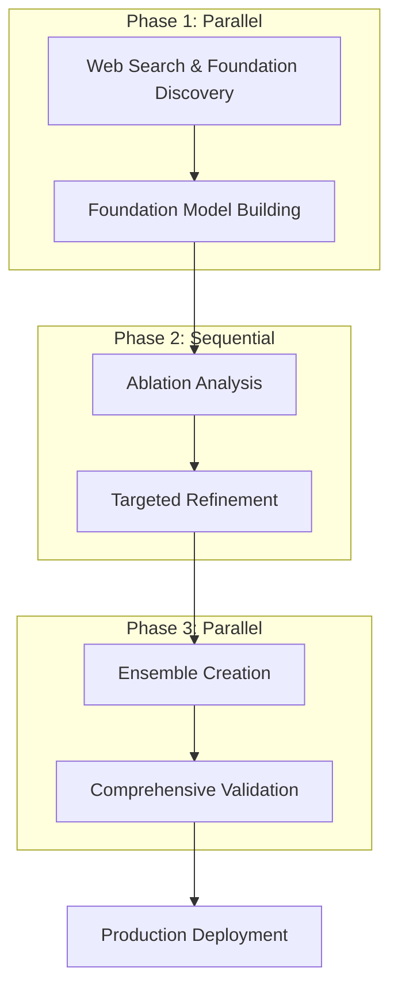

# 🤖 Intelligent Automation Commands

Claude-Flow v2 introduces powerful automation capabilities that intelligently orchestrate AI agents for complex workflows. The automation system combines smart agent spawning, dependency management, and advanced coordination patterns.

## 🎯 **Overview**

The **automation commands** provide:
- **🧠 Intelligent Agent Selection**: Automatically spawns optimal agents based on task complexity
- **⚡ MLE-STAR Workflow Engine**: Machine Learning Engineering via Search and Targeted Refinement
- **🔗 Stream-JSON Chaining**: Real-time agent-to-agent output piping
- **🎛️ Interactive & Non-Interactive Modes**: Flexible execution patterns
- **📊 Real-time Progress Tracking**: Visual task boards and status monitoring

## 📋 **Command Reference**

### Core Automation Commands

```bash
# Auto-spawn agents based on task complexity
claude-flow automation auto-agent --task-complexity <level> [options]

# Smart agent spawning with specific requirements  
claude-flow automation smart-spawn --requirement <description> [options]

# Select optimal workflow for project type
claude-flow automation workflow-select --project-type <type> [options]

# Execute workflow from JSON/YAML files
claude-flow automation run-workflow <file> [options]

# MLE-STAR Machine Learning Engineering workflow (flagship)
claude-flow automation mle-star [options]
```

## 🧠 **Auto-Agent Command**

Automatically spawns optimal agents based on task complexity analysis.

### Usage
```bash
claude-flow automation auto-agent --task-complexity <level> [options]
```

### Complexity Levels
| Level | Agents | Description |
|-------|--------|-------------|
| **low/simple** | 2 agents | 1 coordinator + 1 developer |
| **medium/moderate** | 4 agents | 1 coordinator + 2 developers + 1 researcher |
| **high/complex** | 8 agents | 2 coordinators + 3 developers + 2 researchers + 1 analyzer |
| **enterprise/massive** | 15 agents | 3 coordinators + 5 developers + 3 researchers + 2 analyzers + 2 testers |

### Example
```bash
# Enterprise-level task with optimal agent configuration
claude-flow automation auto-agent --task-complexity enterprise --swarm-id enterprise-api
```

### Output
```
🎯 OPTIMAL AGENT CONFIGURATION:
  🤖 coordinator: 3 agents
  🤖 developer: 5 agents  
  🤖 researcher: 3 agents
  🤖 analyzer: 2 agents
  🤖 tester: 2 agents
  📊 Total agents: 15

✅ Auto-agent spawning completed
🚀 15 agents spawned and configured for enterprise complexity tasks
```

## 🎯 **Smart-Spawn Command**

Intelligently spawns agents based on specific requirements and provides recommendations.

### Usage
```bash
claude-flow automation smart-spawn --requirement <description> [options]
```

### Examples
```bash
# Web development project
claude-flow automation smart-spawn --requirement "web-development" --max-agents 8

# Data analysis workflow
claude-flow automation smart-spawn --requirement "data-analysis" --max-agents 6

# Enterprise API development
claude-flow automation smart-spawn --requirement "enterprise-api-development" --max-agents 12
```

### Smart Recommendations
The system analyzes requirements and suggests optimal agent configurations:

```
🧠 Smart spawning agents based on requirements...
📋 Requirement: web-development
🔢 Max agents: 8

🎯 RECOMMENDED AGENT CONFIGURATION:
  🤖 coordinator: 1 agents - Task orchestration
  🤖 coder: 3 agents - Core development work
  🤖 tester: 1 agents - Quality assurance
  🤖 researcher: 2 agents - Information gathering
  🤖 analyst: 1 agents - Data analysis

📊 SUMMARY:
  📝 Total recommended: 8 agents
  🔢 Max allowed: 8 agents
  ✅ Configuration: Within limits
```

## 🔄 **Workflow-Select Command**

Selects and configures optimal workflows based on project type and priorities.

### Usage
```bash
claude-flow automation workflow-select --project-type <type> --priority <priority>
```

### Project Types
| Type | Phases | Duration | Agents |
|------|--------|----------|--------|
| **web-app** | planning → design → frontend → backend → testing → deployment | 2-4 weeks | coordinator(1) + developer(3) + tester(1) + researcher(1) |
| **api** | specification → design → implementation → testing → documentation | 1-2 weeks | coordinator(1) + developer(2) + tester(1) + researcher(1) |
| **data-analysis** | collection → cleaning → analysis → visualization → reporting | 1-3 weeks | coordinator(1) + researcher(2) + analyzer(2) + developer(1) |
| **enterprise** | requirements → architecture → development → integration → testing → deployment → monitoring | 2-6 months | coordinator(2) + developer(5) + researcher(2) + analyzer(1) + tester(2) |

### Priority Optimizations
- **speed**: +50% agents, parallel execution
- **quality**: +100% testing, code review stages
- **cost**: Minimal agents, sequential execution
- **balanced**: Optimal speed/quality/cost ratio

### Example
```bash
# API project optimized for speed
claude-flow automation workflow-select --project-type api --priority speed
```

## 📋 **Run-Workflow Command**

Executes workflows from JSON/YAML files with Claude CLI integration.

### Usage
```bash
claude-flow automation run-workflow <workflow-file> [options]
```

### Key Options
```bash
--claude                  # Enable Claude CLI integration for actual execution
--non-interactive         # Run in non-interactive mode (no prompts)
--output-format <format>  # Output format (text, json, stream-json)
--variables <json>        # Override workflow variables (JSON format)
--max-concurrency <n>     # Maximum concurrent tasks (default: 3)
--timeout <ms>            # Execution timeout in milliseconds
--verbose                 # Enable detailed logging
```

### Example Workflow File
```json
{
  "name": "API Development Workflow",
  "agents": [
    {"id": "architect", "type": "architect", "name": "System Designer"},
    {"id": "coder", "type": "coder", "name": "API Developer"},
    {"id": "tester", "type": "tester", "name": "Quality Engineer"}
  ],
  "tasks": [
    {
      "id": "design",
      "name": "Design API Architecture", 
      "assignTo": "architect",
      "description": "Create comprehensive API design"
    },
    {
      "id": "implement",
      "name": "Implement Endpoints",
      "assignTo": "coder", 
      "depends": ["design"],
      "description": "Build REST API endpoints"
    },
    {
      "id": "test",
      "name": "Write Tests",
      "assignTo": "tester",
      "depends": ["implement"], 
      "description": "Create comprehensive test suite"
    }
  ]
}
```

### Execution Example
```bash
# Execute custom workflow with Claude integration
claude-flow automation run-workflow my-api-workflow.json --claude --non-interactive
```

## 🧠 **MLE-STAR Workflow (Flagship)**

The **MLE-STAR** (Machine Learning Engineering via Search and Targeted Refinement) workflow is Claude-Flow's flagship automation feature for ML engineering tasks.

### Usage
```bash
claude-flow automation mle-star [options]
```

### Key Features
- **🔍 Web Search Phase**: Finds state-of-the-art ML approaches and solutions
- **🏗️ Foundation Building**: Creates baseline models and training infrastructure
- **🎯 Targeted Refinement**: Focuses deep optimization on high-impact components
- **🏛️ Ensemble Methods**: Intelligent model combination beyond simple averaging
- **✅ Comprehensive Validation**: Rigorous testing with data leakage prevention

### MLE-STAR Options
```bash
--claude                  # Enable Claude CLI integration (recommended)
--dataset <path>          # Path to dataset file (default: ./data/dataset.csv)
--target <column>         # Target column name (default: target)
--output <dir>            # Model output directory (default: ./models/)
--name <experiment>       # Experiment name for tracking
--search-iterations <n>   # Web search iterations (default: 3)
--refinement-iterations <n> # Refinement cycles (default: 5)
--max-agents <n>          # Maximum agents to spawn (default: 6)
--interactive             # Use interactive mode with master coordinator
--non-interactive         # Force non-interactive mode (default for MLE-STAR)
--output-format <format>  # Output format (stream-json enables chaining)
--chaining                # Enable stream-json chaining between agents
--no-chaining             # Disable stream-json chaining
```

### MLE-STAR Phases



### Example Usage
```bash
# Basic MLE-STAR execution (non-interactive by default)
claude-flow automation mle-star --dataset sales-data.csv --target revenue --claude

# MLE-STAR with stream chaining
claude-flow automation mle-star --dataset data.csv --target price --claude --output-format stream-json

# Custom configuration with more iterations
claude-flow automation mle-star \
  --dataset customer-data.csv \
  --target churn \
  --output models/churn/ \
  --name "customer-churn-prediction" \
  --search-iterations 5 \
  --refinement-iterations 8 \
  --max-agents 8
```

### MLE-STAR Output
```
🧠 MLE-STAR: Machine Learning Engineering via Search and Targeted Refinement
🎯 This is the flagship automation workflow for ML engineering tasks

📋 Workflow: MLE-STAR Machine Learning Engineering Workflow
📄 Description: Complete Machine Learning Engineering workflow using MLE-STAR methodology
🎓 Methodology: Search → Foundation → Refinement → Ensemble → Validation
⏱️  Expected Runtime: 2-4 hours

📊 Configuration:
  Dataset: customer-data.csv
  Target: churn
  Output: models/churn/
  Claude Integration: Enabled
  Execution Mode: Non-interactive (default)
  Stream Chaining: Enabled

💡 Running in non-interactive mode: Each agent will execute independently
🔗 Stream chaining enabled: Agent outputs will be piped to dependent agents

📋 Executing 6 tasks in 3 phases...

🔄 Phase 1: 2 concurrent tasks
🔄 Phase 2: 2 concurrent tasks  
🔄 Phase 3: 2 concurrent tasks

🎉 MLE-STAR workflow completed successfully!
📊 Results: 6/6 tasks completed
⏱️  Duration: 2h 15m 30s
🆔 Execution ID: workflow-exec-1704067200000
```

## 🔗 **Stream-JSON Chaining**

When `--output-format stream-json` is enabled, agents automatically pipe their outputs to dependent agents:

```bash
# Agent A generates stream-json output
claude --print --output-format stream-json "Task 1"
     ↓ (stdout piped automatically)
# Agent B receives Agent A's output and continues  
claude --print --input-format stream-json --output-format stream-json "Task 2"
     ↓ (stdout piped automatically)
# Agent C completes the chain
claude --print --input-format stream-json "Task 3"
```

### Chaining Indicators
Look for these console messages:
- `🔗 Enabling stream chaining from task1 to task2`
- `🔗 Chaining: Piping output from previous agent to Agent Name`

## 🎛️ **Execution Modes**

### Non-Interactive Mode (Default for MLE-STAR)
- Each agent spawns independently
- Outputs are processed automatically
- No user prompts or intervention required
- Ideal for CI/CD and automation pipelines

### Interactive Mode
- Single master coordinator manages all agents
- User can interact during execution
- Real-time decision making possible
- Better for exploratory workflows

### Mode Selection
```bash
# Force non-interactive (default for automation commands)
--non-interactive

# Use interactive mode with master coordinator
--interactive

# Auto-detect based on environment
# (no flag = non-interactive for automation commands)
```

## 📊 **Progress Tracking**

All automation commands provide real-time progress tracking:

```
╔═══════════════════════════════════════════════════════════════╗
║                    🤖 CONCURRENT TASK STATUS                   ║
╠═══════════════════════════════════════════════════════════════╣
║ ⠋ RUNNING (3 agents):                                          ║
║   🔬 Analyze Dataset              [████████░░] 2m 15s          ║
║   💻 Build Foundation Model       [██████░░░░] 1m 45s          ║
║   ⚡ Optimize Performance          [███░░░░░░░] 45s             ║
║ ✅ COMPLETED (2):                                              ║
║   ✓ Web Search Research                          3m 20s        ║
║   ✓ Data Quality Analysis                        2m 55s        ║
║ ⏳ QUEUED: 1 tasks waiting                                     ║
╠═══════════════════════════════════════════════════════════════╣
║ 📊 Progress: 67% (4/6) │ ⚡ Active: 3 │ ❌ Failed: 0          ║
╚═══════════════════════════════════════════════════════════════╝
```

## 🔧 **Advanced Configuration**

### Custom Workflow Templates
Create reusable workflow templates for common patterns:

```bash
# Create template from successful workflow
claude-flow automation export-template --workflow-id exec-123 --name "api-development"

# Apply template to new project
claude-flow automation apply-template api-development --variables '{"project":"my-api"}'
```

### Error Handling & Recovery
- **fail-fast**: Stop on first error
- **continue**: Continue despite errors
- **retry**: Automatic retry with exponential backoff

### Resource Management
- **Max Concurrency**: Control parallel task execution
- **Timeout Management**: Per-task and global timeouts
- **Memory Limits**: Prevent resource exhaustion
- **Load Balancing**: Distribute tasks across available resources

## 🎯 **Best Practices**

### 1. Start Simple
```bash
# Begin with basic complexity assessment
claude-flow automation auto-agent --task-complexity medium
```

### 2. Use Appropriate Modes
```bash
# CI/CD pipelines: non-interactive
claude-flow automation mle-star --dataset data.csv --target price --claude --non-interactive

# Exploratory work: interactive  
claude-flow automation mle-star --dataset data.csv --target price --claude --interactive
```

### 3. Enable Stream Chaining for Complex Workflows
```bash
# Complex ML pipelines benefit from chaining
claude-flow automation mle-star --dataset data.csv --target price --claude --output-format stream-json
```

### 4. Monitor Resource Usage
```bash
# Use appropriate agent counts
claude-flow automation smart-spawn --requirement "simple-script" --max-agents 3
claude-flow automation smart-spawn --requirement "enterprise-system" --max-agents 12
```

### 5. Leverage Templates and Reusability
```bash
# Create reusable workflows for common patterns
claude-flow automation workflow-select --project-type api --priority speed > api-speed.json
claude-flow automation run-workflow api-speed.json --claude --non-interactive
```

## 📈 **Performance Benefits**

- **84.8% SWE-Bench Solve Rate**: Superior problem-solving through intelligent coordination
- **2.8-4.4x Speed Improvement**: Parallel execution and optimized task distribution  
- **32.3% Token Reduction**: Efficient coordination reduces redundant operations
- **Automatic Optimization**: Self-tuning based on task complexity and resource availability

## 🔗 **Integration**

### CI/CD Integration
```yaml
# GitHub Actions example
- name: Run MLE-STAR Pipeline
  run: |
    claude-flow automation mle-star \
      --dataset ${{ inputs.dataset }} \
      --target ${{ inputs.target }} \
      --claude \
      --non-interactive \
      --output-format stream-json
```

### Docker Integration
```dockerfile
RUN npm install -g claude-flow@alpha
CMD ["claude-flow", "automation", "mle-star", "--claude", "--non-interactive"]
```

---

## 🔗 **Related Documentation**

- **[Stream Chaining](Stream-Chaining)** - Deep dive into agent-to-agent output piping
- **[MLE-STAR Workflow](MLE-STAR-Workflow)** - Complete methodology guide  
- **[Agent System Overview](Agent-System-Overview)** - Understanding the 64-agent ecosystem
- **[Workflow Orchestration](Workflow-Orchestration)** - Advanced coordination patterns
- **[Non-Interactive Mode](Non-Interactive-Mode)** - CI/CD and automation setup

> 🚀 **Next Steps**: Try the MLE-STAR workflow on your dataset: `claude-flow automation mle-star --dataset your-data.csv --target your-target --claude`