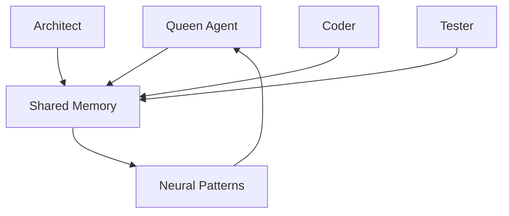

# 🐝 Hive-Mind Intelligence

## 🌟 **Overview**

Hive-Mind Intelligence is Claude-Flow's revolutionary AI coordination system that orchestrates multiple specialized agents to work together on complex development tasks. Inspired by natural hive systems, it features a Queen-led architecture with specialized worker agents that coordinate through shared memory and neural pattern recognition.

## 🏗️ **Architecture**

### Queen-Worker Model

```
    👑 Queen Agent (Coordinator)
         │
    ┌────┼────┬────┬────┐
    │    │    │    │    │
   🏗️   💻   🧪   📊   🔍
  Arch. Code Test Anal. Rsrch.
```

- **👑 Queen Agent**: Central coordinator that orchestrates tasks and manages resources
- **🏗️ Architect**: Designs system architecture and component relationships
- **💻 Coder**: Implements features, fixes bugs, and writes code
- **🧪 Tester**: Creates tests, validates functionality, and ensures quality
- **📊 Analyst**: Analyzes performance, patterns, and optimization opportunities
- **🔍 Researcher**: Gathers information, explores solutions, and provides context

### Communication Patterns



## 🔧 **Initialization**

### Basic Hive Setup

```bash
# Initialize with default settings
claude-flow hive init

# Specify topology and agents
claude-flow hive init --topology mesh --agents 5

# Advanced configuration
claude-flow hive init \
  --topology hierarchical \
  --agents 8 \
  --memory-size 1GB \
  --neural-patterns enabled
```

### Topology Options

#### 1. **Mesh Topology** (Default)
```
Agent1 ←→ Agent2
  ↕       ↕
Agent4 ←→ Agent3
```
- **Best for**: Collaborative tasks, brainstorming, parallel problem-solving
- **Performance**: High coordination, moderate efficiency
- **Use cases**: Full-stack development, complex integrations

#### 2. **Hierarchical Topology**
```
    Queen
   ╱  │  ╲
  A1  A2  A3
     ╱│╲
   A4 A5 A6
```
- **Best for**: Large projects, clear task delegation, structured workflows
- **Performance**: High efficiency, structured coordination
- **Use cases**: Enterprise applications, microservices architecture

#### 3. **Ring Topology**
```
Agent1 → Agent2 → Agent3
  ↑                ↓
Agent5 ← Agent4 ←──╯
```
- **Best for**: Sequential workflows, pipeline processing
- **Performance**: Moderate coordination, high consistency
- **Use cases**: CI/CD pipelines, data processing workflows

#### 4. **Star Topology**
```
    Queen
   ╱│╲│╱
  A1 A2 A3
     A4 A5
```
- **Best for**: Centralized control, simple coordination
- **Performance**: High control, moderate scalability
- **Use cases**: Simple projects, prototyping, learning

## 🧠 **Neural Pattern Recognition**

### Pattern Learning

The hive-mind learns from successful interactions and optimizes future coordination:

```bash
# Enable neural learning
claude-flow neural enable --pattern coordination

# Train on successful workflows
claude-flow neural train \
  --pattern_type coordination \
  --training_data "successful API development workflows"

# View learned patterns
claude-flow neural patterns list --type coordination
```

### Cognitive Models

Claude-Flow includes 27+ cognitive models:

1. **Coordination Patterns**: How agents best work together
2. **Problem-Solving Strategies**: Optimal approaches for different task types
3. **Code Quality Patterns**: Best practices learned from successful implementations
4. **Testing Strategies**: Effective test generation and validation approaches
5. **Architecture Decisions**: Proven architectural patterns for different scales

## 💾 **Shared Memory System**

### Memory Tables

The SQLite memory system includes 12 specialized tables:

```sql
-- Core coordination tables
swarm_state          -- Current hive status and configuration
agent_interactions   -- Inter-agent communication logs
task_history        -- Completed tasks and outcomes
decision_tree       -- Decision-making patterns and rationale

-- Performance and learning tables
performance_metrics  -- Execution time, success rates, efficiency
neural_patterns     -- Learned coordination patterns
code_patterns      -- Successful code implementations
error_patterns     -- Common mistakes and their solutions

-- Project context tables
project_context    -- Current project state and requirements
file_changes      -- Tracked file modifications and reasons
dependencies      -- Project dependencies and relationships
documentation     -- Generated docs and explanations
```

### Memory Operations

```bash
# Store coordination decision
claude-flow memory store \
  "coordination/task-123" \
  "Assigned API development to coder-1, testing to tester-1"

# Retrieve coordination history
claude-flow memory recall "coordination/*" --limit 10

# Search for patterns
claude-flow memory search "authentication" --context project

# Export project memory
claude-flow memory export --project current --format sqlite
```

## 🎯 **Orchestration Modes**

### 1. **Parallel Mode** (Default)
```bash
claude-flow orchestrate "build user authentication" --parallel
```
- All agents work simultaneously on different aspects
- Fastest execution for independent tasks
- Requires good task decomposition

### 2. **Sequential Mode**
```bash
claude-flow orchestrate "deploy to production" --sequential
```
- Agents work in predefined order
- Better for dependent tasks
- More predictable, but slower

### 3. **Adaptive Mode**
```bash
claude-flow orchestrate "optimize database performance" --adaptive
```
- Automatically switches between parallel/sequential based on task dependencies
- Uses neural patterns to determine optimal approach
- Best for complex, multi-faceted problems

### 4. **Hybrid Mode**
```bash
claude-flow orchestrate "full-stack application" --hybrid
```
- Combines multiple coordination strategies
- Parallel for independent components, sequential for dependencies
- Optimal for large, complex projects

## 🔄 **Dynamic Agent Allocation**

### Auto-Scaling

```bash
# Enable auto-scaling based on workload
claude-flow hive config set auto-scale true
claude-flow hive config set min-agents 2
claude-flow hive config set max-agents 12

# Scale based on task complexity
claude-flow orchestrate "complex microservices app" --auto-scale
```

### Specialized Agent Types

```bash
# Spawn specific agent types
claude-flow agent spawn architect --capabilities "system-design,microservices"
claude-flow agent spawn coder --capabilities "react,node.js,typescript"
claude-flow agent spawn tester --capabilities "jest,cypress,load-testing"
claude-flow agent spawn analyst --capabilities "performance,security,metrics"
claude-flow agent spawn researcher --capabilities "libraries,patterns,best-practices"
```

## 📊 **Monitoring and Analytics**

### Real-Time Monitoring

```bash
# Monitor hive activity
claude-flow hive monitor --live --interval 2s

# View agent communications
claude-flow hive comms --tail --agent all

# Performance dashboard
claude-flow hive dashboard --web --port 8080
```

### Performance Metrics

```bash
# Generate performance report
claude-flow hive report --timeframe 24h --format detailed

# Analyze coordination efficiency
claude-flow hive analyze --metric coordination-efficiency

# View success rates by agent type
claude-flow hive stats --by-agent --metric success-rate
```

## 🛠️ **Advanced Configuration**

### Custom Agent Definitions

```yaml
# .claude-flow/agents.yml
agents:
  custom-architect:
    type: architect
    capabilities:
      - microservices
      - event-sourcing
      - domain-driven-design
    neural_patterns:
      - enterprise-architecture
      - scalability-patterns
    memory_access: read-write
    coordination_priority: high

  custom-security:
    type: specialist
    capabilities:
      - security-analysis
      - penetration-testing
      - compliance-review
    neural_patterns:
      - security-patterns
      - vulnerability-detection
    memory_access: read-only
    coordination_priority: critical
```

### Coordination Policies

```yaml
# .claude-flow/coordination.yml
policies:
  task_assignment:
    strategy: capability-based
    load_balancing: enabled
    max_concurrent_tasks: 3
  
  communication:
    frequency: real-time
    conflict_resolution: queen-decides
    consensus_threshold: 0.7
  
  learning:
    pattern_recognition: enabled
    feedback_loop: immediate
    adaptation_rate: moderate
```

## 🚨 **Fault Tolerance**

### Self-Healing Mechanisms

```bash
# Enable fault tolerance
claude-flow hive config set fault-tolerance enabled

# Configure recovery strategies
claude-flow hive config set recovery-strategy "restart-failed-agents"
claude-flow hive config set max-retries 3
claude-flow hive config set timeout 300s
```

### Health Monitoring

```bash
# Check hive health
claude-flow hive health --comprehensive

# Monitor individual agents
claude-flow agent health --agent all --continuous

# Automated recovery
claude-flow hive recovery --auto --strategy conservative
```

## 🎯 **Best Practices**

### 1. **Choose the Right Topology**
- **Mesh**: For collaborative, exploratory tasks
- **Hierarchical**: For large, structured projects
- **Ring**: For sequential, pipeline-based workflows
- **Star**: For simple, centralized coordination

### 2. **Optimize Agent Count**
- **2-3 agents**: Simple tasks, prototyping
- **4-6 agents**: Medium complexity projects
- **7-12 agents**: Large, complex applications
- **12+ agents**: Enterprise-scale development

### 3. **Memory Management**
- Store important decisions and rationale
- Regular memory exports for backup
- Clean up old patterns periodically
- Use namespaces for project organization

### 4. **Neural Pattern Optimization**
- Enable learning for repeated task types
- Review and curate learned patterns
- Export successful patterns for reuse
- Regular pattern validation and updates

## 🔮 **Advanced Features**

### Swarm Evolution

```bash
# Evolve hive based on performance
claude-flow hive evolve --generations 5 --fitness coordination-speed

# Genetic algorithm optimization
claude-flow hive optimize --algorithm genetic --target efficiency
```

### Multi-Hive Coordination

```bash
# Create multiple specialized hives
claude-flow hive create frontend --topology mesh --agents 4
claude-flow hive create backend --topology hierarchical --agents 6

# Coordinate between hives
claude-flow hive coordinate --hives frontend,backend --task "full-stack app"
```

---

**Next Steps:**
- Explore [Agent Types](Agent-Types) for detailed agent capabilities
- Learn about [Memory System](Memory-System) for advanced memory usage
- Try [Workflow Orchestration](Workflow-Orchestration) for complex task management