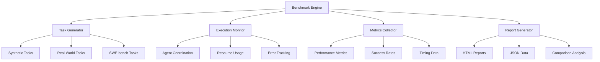

# Performance Benchmarking Guide

## Overview

Claude-flow includes comprehensive benchmarking capabilities to evaluate and optimize AI agent performance across different execution modes, coordination strategies, and task types. This guide covers all benchmarking features and best practices.

## Benchmark System Architecture

### Components



### Benchmark Types

1. **Synthetic Benchmarks**: Controlled tasks for consistent measurement
2. **Real-World Benchmarks**: Actual software engineering tasks  
3. **SWE-bench Integration**: Official academic benchmark
4. **Load Testing**: High-concurrency performance evaluation
5. **Stress Testing**: Resource limit and failure mode analysis

## Quick Start

### Basic Benchmarking

```bash
# Run standard benchmark suite
swarm-bench run --strategy development --mode centralized

# Compare multiple configurations
swarm-bench run --strategy development,optimization,research --mode centralized,distributed

# Load test with high concurrency
swarm-bench load-test --agents 50 --tasks 100
```

### SWE-bench Evaluation

```bash
# Quick SWE-bench test
swarm-bench swe-bench official --limit 10

# Multi-mode comparison
swarm-bench swe-bench multi-mode --instances 5

# Full evaluation
swarm-bench swe-bench official --lite
```

## Command Reference

### Core Benchmarking

```bash
swarm-bench run [OPTIONS]
```

**Options:**
- `--strategy STRATEGY`: Execution strategy (development, optimization, research, testing)
- `--mode MODE`: Coordination mode (centralized, distributed, hierarchical, mesh)
- `--agents N`: Number of agents (1-50)
- `--tasks N`: Number of tasks to execute
- `--timeout N`: Task timeout in seconds
- `--iterations N`: Number of benchmark iterations
- `--output DIR`: Output directory for results
- `--config FILE`: Custom configuration file

**Examples:**
```bash
# Basic performance test
swarm-bench run --strategy development --mode centralized --agents 5

# Comprehensive evaluation
swarm-bench run --strategy development,optimization --mode centralized,distributed --agents 3,5,8

# Custom configuration
swarm-bench run --config benchmark-config.yaml --iterations 10
```

### Load Testing

```bash
swarm-bench load-test [OPTIONS]
```

**Options:**
- `--agents N`: Concurrent agents (default: 10)
- `--tasks N`: Total tasks (default: 100)
- `--duration N`: Test duration in seconds
- `--ramp-up N`: Ramp-up time in seconds
- `--target-rate N`: Target tasks per second

**Examples:**
```bash
# Standard load test
swarm-bench load-test --agents 20 --tasks 200

# Sustained load test
swarm-bench load-test --duration 300 --target-rate 5

# Stress test
swarm-bench load-test --agents 100 --tasks 1000
```

### Comparison Analysis

```bash
swarm-bench compare [OPTIONS] RESULT1 RESULT2 [RESULT3...]
```

**Options:**
- `--metric METRIC`: Primary comparison metric (success_rate, duration, throughput)
- `--format FORMAT`: Output format (table, json, html)
- `--output FILE`: Save comparison report

**Examples:**
```bash
# Compare two benchmark runs
swarm-bench compare results/run1.json results/run2.json

# Generate HTML comparison report  
swarm-bench compare --format html --output comparison.html results/*.json
```

## Configuration Files

### Benchmark Configuration

```yaml
# benchmark-config.yaml
benchmark:
  name: "Custom Performance Test"
  description: "Testing optimal configurations"
  
tasks:
  types: ["coding", "analysis", "debugging"]
  difficulty: ["easy", "medium", "hard"]
  count: 50
  timeout: 300

execution:
  strategies: ["development", "optimization"]
  modes: ["centralized", "distributed", "mesh"]
  agent_counts: [3, 5, 8, 12]
  max_retries: 3

output:
  directory: "benchmark/results"
  formats: ["json", "html", "csv"]
  include_logs: true
  
reporting:
  metrics:
    - "success_rate"
    - "average_duration" 
    - "throughput"
    - "error_rate"
    - "resource_usage"
  charts:
    - "performance_trends"
    - "agent_efficiency"
    - "error_distribution"
```

### Agent Configuration Profiles

```yaml
# agent-profiles.yaml
profiles:
  lightweight:
    max_agents: 3
    coordination: "centralized"
    timeout: 120
    memory_limit: "256MB"
    
  standard:
    max_agents: 5
    coordination: "distributed"
    timeout: 300
    memory_limit: "512MB"
    
  high_performance:
    max_agents: 8
    coordination: "mesh"
    timeout: 600
    memory_limit: "1GB"
    
  maximum:
    max_agents: 12
    coordination: "hierarchical"
    timeout: 900
    memory_limit: "2GB"
```

## Metrics and KPIs

### Performance Metrics

**Success Rate**
- Definition: Percentage of tasks completed successfully
- Target: >85% for production workloads
- Calculation: `successful_tasks / total_tasks * 100`

**Average Duration**
- Definition: Mean time to complete tasks
- Target: <5 minutes for simple tasks, <15 minutes for complex
- Includes: Queue time + execution time + coordination overhead

**Throughput**
- Definition: Tasks completed per unit time
- Target: >10 tasks/hour for development workflows
- Calculation: `completed_tasks / total_time_hours`

**Agent Efficiency**
- Definition: Percentage of time agents spend on productive work
- Target: >70% utilization
- Factors: Coordination overhead, idle time, resource contention

**Resource Utilization**
- CPU Usage: Target <80% average, <95% peak
- Memory Usage: Target <70% of available memory
- Network I/O: Bandwidth utilization for distributed coordination

### Quality Metrics

**Code Quality** (for software engineering tasks)
- Syntax correctness
- Logical soundness  
- Best practices adherence
- Test coverage

**Solution Accuracy**
- Requirement fulfillment
- Edge case handling
- Error handling robustness

**Coordination Effectiveness**
- Message passing efficiency
- Consensus achievement time
- Conflict resolution success

## Performance Optimization

### Configuration Tuning

**Agent Count Optimization**
```bash
# Find optimal agent count for your workload
swarm-bench optimize --metric throughput --param agents --range 1,20

# Results example:
# 3 agents: 12.5 tasks/hour
# 5 agents: 18.3 tasks/hour  ← Optimal
# 8 agents: 16.2 tasks/hour (coordination overhead)
```

**Coordination Mode Selection**
```bash
# Test different coordination modes
swarm-bench run --mode centralized,distributed,hierarchical,mesh --agents 5

# Performance comparison:
# centralized: Fast for simple tasks, bottlenecks at scale
# distributed: Good scalability, higher latency
# hierarchical: Balanced, good for complex workflows
# mesh: Highest throughput, most resource intensive
```

**Strategy Optimization**
```bash
# Compare strategies for your task type
swarm-bench run --strategy development,optimization,research,testing

# Task-specific recommendations:
# development: General purpose, good baseline
# optimization: Best performance for complex tasks
# research: Better for exploratory/analytical work
# testing: Focused on validation and quality
```

### System Tuning

**Memory Optimization**
```bash
# Monitor memory usage during benchmarks
swarm-bench run --monitor-memory --agents 8

# Recommended settings:
# JVM heap: -Xmx2G (adjust based on agent count)
# Node.js: --max-old-space-size=4096
# Python: Set appropriate limits for worker processes
```

**Concurrency Tuning**
```bash
# Test different concurrency levels
swarm-bench load-test --agents 10,20,30,40,50

# Find the sweet spot between throughput and stability
```

## Automated Performance Testing

### Continuous Integration

```yaml
# .github/workflows/benchmark.yml
name: Performance Benchmark
on:
  push:
    branches: [main]
  schedule:
    - cron: '0 2 * * *'  # Daily at 2 AM

jobs:
  benchmark:
    runs-on: ubuntu-latest
    steps:
      - uses: actions/checkout@v3
      
      - name: Setup Node.js
        uses: actions/setup-node@v3
        with:
          node-version: '18'
          
      - name: Install dependencies
        run: npm install
        
      - name: Build claude-flow
        run: npm run build
        
      - name: Run performance benchmarks
        run: |
          swarm-bench run --agents 5 --iterations 3
          swarm-bench swe-bench official --limit 10
          
      - name: Upload results
        uses: actions/upload-artifact@v3
        with:
          name: benchmark-results
          path: benchmark/results/
```

### Performance Regression Detection

```bash
#!/bin/bash
# performance-regression.sh

# Run current benchmark
swarm-bench run --config baseline-config.yaml --output current/

# Compare with baseline
swarm-bench compare baseline/results.json current/results.json --format json --output comparison.json

# Check for regression (>10% performance decrease)
python scripts/check-regression.py comparison.json --threshold 0.10

if [ $? -ne 0 ]; then
    echo "Performance regression detected!"
    exit 1
fi
```

## Advanced Benchmarking

### Custom Task Generation

```python
# custom_tasks.py
from benchmark.src.swarm_benchmark.core.task_generator import TaskGenerator

class CustomTaskGenerator(TaskGenerator):
    def generate_coding_task(self, difficulty="medium"):
        return {
            "type": "coding",
            "difficulty": difficulty,
            "description": "Implement a REST API endpoint",
            "requirements": [
                "Create /api/users endpoint",
                "Support GET, POST, PUT, DELETE",
                "Include input validation",
                "Add error handling"
            ],
            "expected_duration": 300,
            "validation_criteria": [
                "Code compiles successfully",
                "All endpoints return correct responses",
                "Error cases handled appropriately"
            ]
        }
```

### Distributed Benchmarking

```yaml
# distributed-benchmark.yaml
distributed:
  coordinator_node: "benchmark-controller"
  worker_nodes: 
    - "worker-1"
    - "worker-2"
    - "worker-3"
  
  load_distribution:
    strategy: "round_robin"
    tasks_per_node: 25
    
  synchronization:
    barrier_timeout: 300
    result_collection_timeout: 600
```

### Real-Time Monitoring

```bash
# Start real-time monitoring dashboard
swarm-bench monitor --dashboard --port 8080

# Access at http://localhost:8080 to see:
# - Live performance metrics
# - Agent status and coordination
# - Task completion rates
# - Resource utilization graphs
```

## Interpreting Results

### Performance Report Example

```json
{
  "benchmark_id": "perf-test-2025-01-07",
  "timestamp": "2025-01-07T16:30:00Z",
  "configuration": {
    "strategy": "optimization",
    "mode": "mesh",
    "agents": 8,
    "tasks": 100
  },
  "results": {
    "success_rate": 0.87,
    "average_duration": 245.3,
    "throughput": 14.6,
    "total_duration": 4107.2
  },
  "agent_performance": {
    "utilization": 0.73,
    "coordination_overhead": 0.12,
    "idle_time": 0.15
  },
  "resource_usage": {
    "peak_memory_mb": 1024,
    "average_cpu_percent": 65,
    "network_bytes": 2048576
  }
}
```

### Optimization Recommendations

**High Success Rate + High Duration**
- Consider adding more agents
- Check for inefficient coordination
- Optimize task algorithms

**Low Success Rate + Normal Duration**
- Review error patterns
- Improve error handling
- Validate input data quality

**Good Performance + High Resource Usage**
- Optimize memory allocation
- Reduce coordination overhead
- Consider lighter coordination modes

## Troubleshooting

### Common Issues

**Low Throughput**
```bash
# Diagnose throughput issues
swarm-bench diagnose --metric throughput

# Common causes:
# - Insufficient agent count
# - Coordination bottlenecks
# - Resource constraints
# - Network latency (distributed mode)
```

**High Error Rate**
```bash
# Analyze error patterns
swarm-bench analyze-errors --input results/benchmark.json

# Check for:
# - Timeout issues (increase task timeout)
# - Resource exhaustion (reduce concurrent agents)
# - Coordination failures (check network stability)
```

**Memory Issues**
```bash
# Monitor memory usage during benchmarks
swarm-bench run --monitor-memory --profile-memory

# Optimize based on results:
# - Reduce agent count if memory constrained
# - Implement memory cleanup strategies
# - Use streaming for large data processing
```

### Debug Mode

```bash
# Enable debug logging
export LOG_LEVEL=DEBUG
swarm-bench run --debug --agents 3 --tasks 10

# Trace individual agent actions
swarm-bench run --trace-agents --output-traces traces/
```

## Best Practices

### Benchmark Design

1. **Establish Baselines**: Run benchmarks on known configurations
2. **Control Variables**: Change one parameter at a time
3. **Statistical Significance**: Run multiple iterations
4. **Environment Consistency**: Use identical hardware/software
5. **Realistic Workloads**: Use representative task types

### Result Analysis

1. **Trend Analysis**: Look for patterns over time
2. **Outlier Investigation**: Understand extreme values
3. **Cross-Validation**: Verify results with different approaches
4. **Business Context**: Relate metrics to business objectives

### Continuous Improvement

1. **Regular Benchmarking**: Automated performance testing
2. **Performance Goals**: Set and track specific targets
3. **Regression Prevention**: Detect performance degradation early
4. **Optimization Cycles**: Regular performance tuning

## Resources

### Tools and Utilities

- **Performance Dashboard**: Real-time monitoring interface
- **Comparison Tools**: Side-by-side result analysis  
- **Report Generators**: Automated HTML/PDF reports
- **Data Export**: CSV/JSON export for external analysis

### Integration Examples

- **Grafana Integration**: Custom dashboards for metrics
- **Prometheus Metrics**: Time-series performance data
- **CI/CD Integration**: Automated performance gates
- **Slack Notifications**: Performance alerts and reports

---

*Last updated: January 2025*
*Version: Alpha-88*