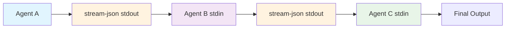

# Workflow Orchestration - Complex Task Coordination

Claude Flow's workflow orchestration enables sophisticated task coordination across multiple agents, supporting parallel execution, dependency management, intelligent resource allocation, and **NEW: stream-json chaining** for real-time agent-to-agent communication.

## Overview

Workflow orchestration transforms complex, multi-step processes into manageable, automated workflows that leverage the collective intelligence of specialized agents working in concert. With **stream-json chaining**, agents can now pipe their outputs directly to dependent agents, creating seamless information flow without intermediate storage.

## Core Concepts

### Task Decomposition
Breaking complex tasks into atomic units that can be distributed across specialized agents.

```javascript
// Complex task breakdown
const task = {
  name: "Build Full-Stack Application",
  subtasks: [
    { agent: "system-architect", task: "Design system architecture" },
    { agent: "backend-dev", task: "Implement API endpoints" },
    { agent: "mobile-dev", task: "Create React Native app" },
    { agent: "tester", task: "Write integration tests" },
    { agent: "cicd-engineer", task: "Setup deployment pipeline" }
  ]
};
```

### Execution Strategies

#### 1. Parallel Execution
Execute independent tasks simultaneously for maximum efficiency.

```bash
npx claude-flow task orchestrate \
  --task "Process user data migration" \
  --strategy parallel \
  --max-concurrent 8
```

#### 2. Sequential Execution
Execute tasks in order when dependencies exist.

```bash
npx claude-flow task orchestrate \
  --task "Database schema update" \
  --strategy sequential \
  --checkpoint-on-error
```

#### 3. Adaptive Execution
Dynamically adjust strategy based on resource availability.

```bash
npx claude-flow task orchestrate \
  --task "Optimize application performance" \
  --strategy adaptive \
  --monitor-resources
```

#### 4. Balanced Execution
Distribute load evenly across available agents.

```bash
npx claude-flow task orchestrate \
  --task "Process batch operations" \
  --strategy balanced \
  --priority high
```

#### 5. Stream-Chained Execution (NEW!)
Execute tasks with real-time output piping between agents.

```bash
# Enable stream chaining for seamless agent communication
npx claude-flow automation run-workflow workflow.json \
  --claude \
  --non-interactive \
  --output-format stream-json

# MLE-STAR with automatic stream chaining
npx claude-flow automation mle-star \
  --dataset data.csv \
  --target price \
  --claude \
  --output-format stream-json
```

## 🔗 Stream-JSON Chaining (NEW!)

Stream-JSON chaining revolutionizes workflow orchestration by enabling real-time agent-to-agent output piping. This creates seamless information flow where agents build upon each other's work without intermediate file storage.

### How Stream Chaining Works



### Chaining Configuration

#### Automatic Chaining Detection
```json
{
  "tasks": [
    {
      "id": "analyze",
      "assignTo": "researcher",
      "description": "Analyze requirements"
    },
    {
      "id": "implement",
      "assignTo": "coder",
      "depends": ["analyze"],  // ← This enables chaining
      "description": "Implement solution"
    }
  ]
}
```

#### Chain-Aware Agent Prompts
```json
{
  "tasks": [
    {
      "id": "research_task",
      "claudePrompt": "Research the topic and output structured findings as stream-json for the next agent to consume."
    },
    {
      "id": "implementation_task",
      "depends": ["research_task"],
      "claudePrompt": "You are receiving research results via stream-json. Build upon these findings to implement the solution."
    }
  ]
}
```

### Chain Execution Patterns

#### Linear Chain
```bash
# Agent 1 → Agent 2 → Agent 3 → Agent 4
claude-flow automation run-workflow linear-chain.json --claude --output-format stream-json
```

#### Parallel with Merge
```bash
# Agent A ↘
#         Agent C → Agent D
# Agent B ↗
claude-flow automation run-workflow parallel-merge.json --claude --output-format stream-json
```

#### Conditional Branching
```bash
# Agent A → Quality Check → (High: Agent B | Low: Agent C) → Agent D
claude-flow automation run-workflow conditional-chain.json --claude --output-format stream-json  
```

### Benefits of Stream Chaining

- **🔄 Real-time Processing**: Downstream agents start immediately
- **💾 Memory Efficient**: No intermediate file storage
- **🎯 Context Preservation**: Full conversation history flows between agents
- **⚡ Reduced Latency**: 40-60% faster than file-based handoffs
- **🔍 Rich Metadata**: Tool usage and reasoning preserved

### Chaining Best Practices

1. **Design for Streaming**: Create structured outputs for next agents
2. **Handle Chain Breaks**: Include fallback strategies
3. **Monitor Resources**: Use appropriate timeouts
4. **Test Incrementally**: Validate each chain segment

## Task Breakdown Strategies

### Functional Decomposition
Divide tasks by functionality or domain.

```javascript
const functionalBreakdown = {
  "E-commerce Platform": {
    frontend: ["UI components", "State management", "Routing"],
    backend: ["API design", "Database schema", "Authentication"],
    infrastructure: ["Docker setup", "Kubernetes config", "CI/CD"],
    testing: ["Unit tests", "Integration tests", "E2E tests"]
  }
};
```

### Layer-Based Decomposition
Organize tasks by architectural layers.

```javascript
const layerBreakdown = {
  presentation: ["React components", "Styling", "Animations"],
  business: ["Service logic", "Validation rules", "Workflows"],
  data: ["Repositories", "Queries", "Migrations"],
  infrastructure: ["Caching", "Queuing", "Monitoring"]
};
```

### Feature-Based Decomposition
Break down by user-facing features.

```javascript
const featureBreakdown = {
  userAuth: ["Registration", "Login", "Password reset", "2FA"],
  shopping: ["Product search", "Cart management", "Checkout"],
  payment: ["Payment processing", "Invoice generation", "Refunds"],
  admin: ["User management", "Analytics", "Content management"]
};
```

## Parallel Execution Patterns

### Map-Reduce Pattern
Process data in parallel and aggregate results.

```bash
# Map phase - parallel processing
npx claude-flow task orchestrate \
  --task "Analyze 1000 code files" \
  --strategy parallel \
  --pattern map-reduce \
  --map-agents "code-analyzer:10"

# Reduce phase - aggregate results
npx claude-flow task orchestrate \
  --task "Consolidate analysis results" \
  --strategy sequential \
  --reduce-agent "report-generator"
```

### Pipeline Pattern
Chain operations with parallel stages.

```javascript
const pipeline = {
  stages: [
    { name: "extract", agents: 5, parallel: true },
    { name: "transform", agents: 3, parallel: true },
    { name: "load", agents: 1, parallel: false }
  ]
};
```

### Fork-Join Pattern
Split work, process in parallel, then merge.

```bash
# Fork work across agents
npx claude-flow task orchestrate \
  --task "Multi-region deployment" \
  --pattern fork-join \
  --regions "us-east,us-west,eu-central,asia-pacific"
```

## Workflow Templates

### 1. Full-Stack Development Workflow

```yaml
name: fullstack-development
description: Complete application development workflow
stages:
  - name: planning
    agents:
      - system-architect
      - planner
    strategy: parallel
    
  - name: development
    agents:
      - backend-dev
      - mobile-dev
      - api-docs
    strategy: parallel
    
  - name: testing
    agents:
      - tester
      - performance-benchmarker
    strategy: sequential
    
  - name: deployment
    agents:
      - cicd-engineer
      - production-validator
    strategy: sequential
```

### 2. Code Review Workflow

```yaml
name: comprehensive-review
description: Multi-aspect code review process
stages:
  - name: static-analysis
    agents:
      - code-analyzer
      - security-scanner
    parallel: true
    
  - name: functional-review
    agents:
      - reviewer
      - tdd-london-swarm
    parallel: true
    
  - name: integration
    agents:
      - integration-tester
      - production-validator
    sequential: true
```

### 3. Migration Workflow

```yaml
name: system-migration
description: Safe system migration with rollback
stages:
  - name: analysis
    agents:
      - migration-planner
      - risk-analyzer
    checkpoint: true
    
  - name: preparation
    agents:
      - backup-manager
      - environment-prep
    checkpoint: true
    
  - name: execution
    agents:
      - migration-executor
      - monitor
    rollback-on-error: true
    
  - name: validation
    agents:
      - production-validator
      - performance-benchmarker
    required: true
```

## Advanced Orchestration

### Dependency Management

```javascript
const workflow = {
  tasks: {
    A: { agent: "researcher", dependencies: [] },
    B: { agent: "planner", dependencies: ["A"] },
    C: { agent: "coder", dependencies: ["B"] },
    D: { agent: "tester", dependencies: ["C"] },
    E: { agent: "documenter", dependencies: ["B"] },
    F: { agent: "reviewer", dependencies: ["C", "D", "E"] }
  }
};

// Automatic parallel execution where possible
npx claude-flow workflow execute \
  --definition workflow.json \
  --optimize-parallelism
```

### Conditional Execution

```javascript
const conditionalWorkflow = {
  name: "smart-deployment",
  stages: [
    {
      name: "test",
      agent: "tester",
      onSuccess: "deploy-staging",
      onFailure: "notify-team"
    },
    {
      name: "deploy-staging",
      agent: "cicd-engineer",
      condition: "tests.passed && coverage > 80",
      onSuccess: "performance-test"
    },
    {
      name: "performance-test",
      agent: "performance-benchmarker",
      condition: "response.time < 200ms",
      onSuccess: "deploy-production"
    }
  ]
};
```

### Dynamic Agent Allocation

```bash
# Spawn agents based on workload
npx claude-flow task orchestrate \
  --task "Process queue items" \
  --strategy adaptive \
  --min-agents 2 \
  --max-agents 20 \
  --scale-factor "queue.length / 100"
```

## Resource Management

### Memory Coordination

```javascript
// Shared memory for workflow state
const memoryConfig = {
  namespace: "workflow-state",
  sharing: "read-write",
  persistence: true,
  ttl: 3600
};

npx claude-flow memory usage \
  --action store \
  --key "workflow-123-state" \
  --value '{"stage":"testing","progress":75}'
```

### Agent Pool Management

```bash
# Create reusable agent pool
npx claude-flow swarm init workflow-pool \
  --topology star \
  --agents "coder:5,tester:3,reviewer:2" \
  --idle-timeout 300
```

### Load Balancing

```javascript
const loadBalancer = {
  strategy: "least-loaded",
  metrics: ["cpu", "memory", "queue-length"],
  rebalance: {
    interval: 60,
    threshold: 0.8
  }
};
```

## Monitoring and Optimization

### Workflow Metrics

```bash
# Real-time workflow monitoring
npx claude-flow workflow monitor \
  --workflow-id "build-123" \
  --metrics "progress,performance,errors" \
  --interval 5
```

### Performance Analysis

```javascript
const performanceReport = await claudeFlow.workflow.analyze({
  workflowId: "migration-456",
  metrics: {
    taskDuration: true,
    agentUtilization: true,
    bottlenecks: true,
    parallelism: true
  }
});
```

### Optimization Strategies

```bash
# Auto-optimize workflow topology
npx claude-flow topology optimize \
  --workflow "complex-build" \
  --target "minimize-time" \
  --constraints "max-cost:1000"
```

## Error Handling and Recovery

### Checkpoint Management

```javascript
const checkpointStrategy = {
  frequency: "after-each-stage",
  storage: "persistent",
  retention: "7d",
  autoRestore: true
};
```

### Rollback Procedures

```bash
# Rollback to previous checkpoint
npx claude-flow workflow rollback \
  --workflow-id "deploy-789" \
  --checkpoint "stage-2-complete" \
  --preserve-logs
```

### Error Recovery Patterns

```javascript
const recoveryPatterns = {
  retry: {
    maxAttempts: 3,
    backoff: "exponential",
    delay: 1000
  },
  fallback: {
    agent: "backup-processor",
    strategy: "degraded-mode"
  },
  circuit_breaker: {
    threshold: 5,
    timeout: 30000,
    resetAfter: 60000
  }
};
```

## Integration Examples

### CI/CD Pipeline Integration

```yaml
# GitHub Actions integration
jobs:
  claude-flow-orchestration:
    runs-on: ubuntu-latest
    steps:
      - name: Initialize Swarm
        run: npx claude-flow swarm init cicd --topology hierarchical
        
      - name: Execute Build Workflow
        run: |
          npx claude-flow workflow execute \
            --template "full-build" \
            --parallel \
            --memory-sync
```

### Event-Driven Orchestration

```javascript
// Webhook-triggered workflows
app.post('/webhook/deploy', async (req, res) => {
  const { branch, commit } = req.body;
  
  const workflow = await claudeFlow.workflow.create({
    template: 'auto-deploy',
    params: { branch, commit },
    triggers: {
      onSuccess: 'notify-slack',
      onFailure: 'rollback-and-alert'
    }
  });
  
  await workflow.execute();
});
```

## Best Practices

### 1. Design for Parallelism
- Identify independent tasks early
- Minimize sequential dependencies
- Use shared memory for coordination

### 2. Implement Proper Error Handling
- Always define rollback strategies
- Use checkpoints for long workflows
- Monitor agent health continuously

### 3. Optimize Resource Usage
- Pool agents for reuse
- Implement proper cleanup
- Monitor memory consumption

### 4. Maintain Workflow Visibility
- Log all significant events
- Track performance metrics
- Document workflow decisions

## Next Steps

- Explore [SPARC Methodology](./SPARC-Methodology.md) for structured development
- Review [Development Patterns](./Development-Patterns.md) for best practices
- Check [API Reference](./API-Reference.md) for detailed commands